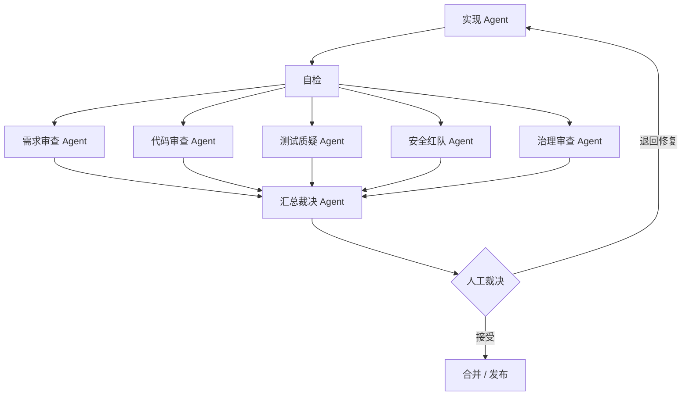

# AI 先审验收总览

传统验收把人放在第一层：AI 写完一大包代码，人再看代码差异、点页面、跑测试。AI 生成越快，人越容易成为瓶颈。

AI 先审验收要把顺序倒过来：先让 AI 做分层审查和证据整理，人只裁决高风险、争议项和产品判断。

但 AI 先审不等于每次都跑满流程。验收强度必须和风险、影响范围、可逆性、Token 预算匹配。预算不足时，应该缩小任务、压缩低风险检查，或让人补充关键上下文；不能跳过安全、数据和发布闸门。

## 核心流程

## 为什么要 AI 先审

| 问题 | 传统方式 | AI 先审方式 |
| --- | --- | --- |
| 代码差异太大 | 人逐行看，疲劳后容易漏审 | AI 先分层扫描，只把高风险问题推给人 |
| 测试不可信 | 人随机看几个测试 | 测试质疑 Agent 专门攻击测试可信度 |
| 安全风险隐蔽 | 普通审查顺带看一下 | 安全红队 Agent 独立寻找绕过路径 |
| 规则太多 | 人靠记忆执行 | 治理审查 Agent 固定执行仓库规则 |
| 证据分散 | 测试、日志、截图到处找 | 证据汇总到同一份验收报告 |

## 进入人工裁决前必须满足什么

AI 生成变更进入人工裁决前，应满足：

- 实现 Agent 已完成自检，并运行最小验证命令。
- 至少经过需求、测试、安全、治理四类审查。
- 审查输出结构化问题清单，而不只是自然语言总结。
- 阻断级问题已修复，或明确需要人工豁免。
- 高风险问题有证据、影响范围和建议修复方式。
- 没有“测试通过但需求无证据”的验收项。
- 汇总裁决 Agent 已去重、定级，并标出必须由人决定的问题。

## 按预算选择验收强度

| 场景 | 推荐验收强度 |
| --- | --- |
| 文案、样式、低风险配置 | 简化模式：最小验证 + 1 个定向审查 Agent + 人工抽样 |
| 普通功能切片 | 标准模式：需求 / 代码 / 测试审查 + 关键路径证据 |
| 权限、租户、支付、数据迁移、生产发布 | 严控模式：完整审查 Agent 组 + 安全红队 + 验收证据包 + 人工关口 |

如果 Token 或时间预算不足，不要把严控模式降级成简化模式。正确做法是拆小任务、延期执行，或由人手工完成关键检查并记录证据。

## 人最终只看什么

- 产品行为是否符合目标用户。
- 阻断级 / 高风险问题是接受还是退回。
- 架构方向是否偏离事实源。
- 安全、数据、兼容、发布风险是否允许。
- 审查 Agent 之间是否有冲突结论。

没有 AI 审查报告的变更，不应进入人工验收。人不应该被迫从零审完整代码差异。
