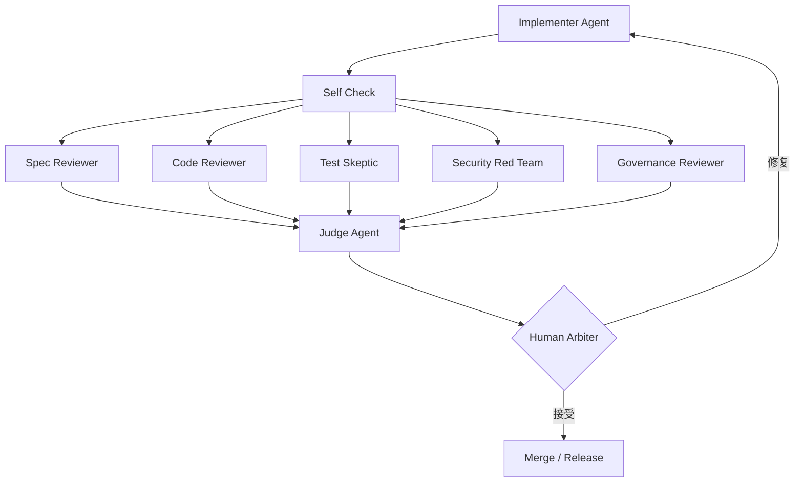

# AI-Native 验收总览

传统验收把人放在第一层：AI 写完很多代码，人再看 diff、点页面、跑测试。这会让人类成为瓶颈。AI-native 验收把顺序倒过来：AI 先做规模化审查和证据整理，人只裁决高风险与争议。

## 核心模型

## 为什么要 AI 先审

| 问题 | 传统方式 | AI-native 方式 |
| --- | --- | --- |
| diff 太大 | 人逐行看，疲劳漏审 | AI 先分层扫描，输出高风险摘要 |
| 测试不可信 | 人随机看几个测试 | Test Skeptic 专门攻击测试有效性 |
| 安全风险隐蔽 | 普通 reviewer 顺带看 | Security Red Team 独立找绕过路径 |
| 规则太多 | 人靠记忆执行 | Governance Reviewer 固定执行仓库规则 |
| 证据分散 | 测试、日志、截图各处找 | Evidence Builder 汇总到验收包 |

## 通过标准

一个 AI 生成变更进入人类最终裁决前，应满足：

- 已运行 Implementer 自检和最小验证命令。
- 至少经过 Spec、Test、Security、Governance 四类 AI reviewer。
- reviewer 输出结构化 findings，不只是自然语言总结。
- blocker 已修复，或明确需要人类豁免。
- high 风险有证据、影响范围和建议修复。
- 没有“测试通过但需求无证据”的 PRD 条目。
- Judge Agent 已去重、定级并标出人类必须决策的点。

## 人类最终只看什么

- 产品行为是否符合目标用户。
- blocker / high finding 是否接受或退回。
- 架构方向是否偏离事实源。
- 安全、数据、兼容、发布风险是否允许。
- reviewer 之间的冲突结论。

人不应该被迫从零审查整个 diff。没有 AI 审查报告的变更，不应进入人类验收。
