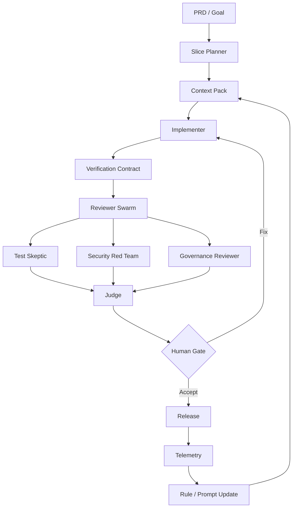

# 附录：Harness Engine 阅读地图

这页把 Anthropic、OpenAI、LangChain 和 Claude Code 的几篇核心资料放在一起，形成 AI Coding Harness 的阅读顺序。

## 推荐阅读顺序

| 顺序 | 资料 | 先读它的原因 |
| --- | --- | --- |
| 1 | Anthropic Harness Design | 先理解为什么长任务应用开发需要 generator / evaluator / harness |
| 2 | OpenAI Building Agents | 再理解 agent 的 model / tools / instructions、run loop、guardrails、human intervention |
| 3 | LangChain Framework / Runtime / Harness | 然后区分 framework、runtime、harness，避免架构概念混乱 |
| 4 | Claude Code Best Practices | 最后落到日常 coding agent 的具体操作习惯 |

## 四篇资料分别解决什么问题

| 资料 | 解决的问题 | 本站吸收为 |
| --- | --- | --- |
| Anthropic Harness Design | 长时间开发任务如何保持质量和方向 | Generator / Evaluator / Sprint Contract / Playwright QA |
| OpenAI Building Agents | 生产 Agent 如何设计工具、编排和 guardrails | Tool Risk Model / Run Loop / Human Gate |
| LangChain Harness 分层 | Agent stack 如何区分 framework、runtime、harness | AI Coding Harness 架构分层 |
| Claude Code Best Practices | coding agent 日常如何配置、验证、并行、自动化 | Context Pack / Verification Contract / Subagents / Worktrees |

## 统一成本站模型

```text
Weights 提供基础能力
Context 提供任务知识
Framework 提供模型和工具抽象
Runtime 提供持久执行和人类中断
Harness 提供面向 AI Coding 的流程、审查、证据和发布门
```

## AI Coding Harness 的完整闭环



## 从资料到工程实践

- Anthropic 让我们重视 evaluator 和真实 UI 验证。
- OpenAI 让我们重视工具分级、guardrails 和 human intervention。
- LangChain 让我们重视 durable runtime、checkpoint 和 harness 分层。
- Claude Code 让我们重视具体开发习惯：先探索、计划、验证，使用 subagents 和 worktrees。

## 站内阅读入口

- [Harness 总览](/harness/overview)
- [业界 Harness 模式整理](/harness/industry-patterns)
- [AI Coding Harness 蓝图](/harness/ai-coding-harness)
- [Claude Code Best Practices 原文导读](/appendix/claude-code-best-practices)
- [OpenAI Building Agents 原文导读](/appendix/openai-building-agents-guide)
- [LangChain Framework / Runtime / Harness 原文导读](/appendix/langchain-framework-runtime-harness)
