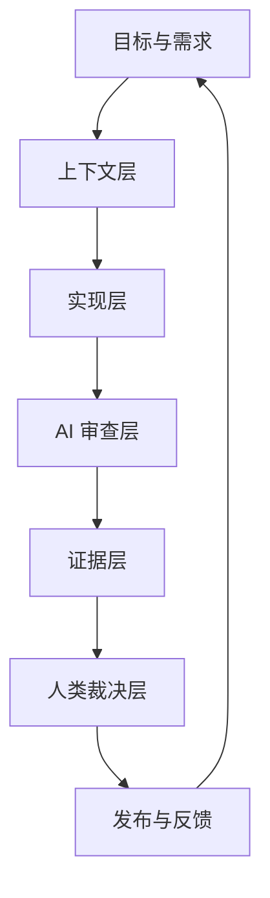

# AI Coding 操作系统

AI Coding 操作系统是一组稳定约束，而不是一组零散提示词。它要回答：AI 从哪里拿事实、如何拆任务、如何实现、如何自审、如何交付证据、人类在哪里介入。

## 六层结构

| 层级 | 责任 | 典型产物 |
| --- | --- | --- |
| 目标与需求 | 定义做什么、不做什么、验收标准 | 需求说明、issue、用户路径、非目标 |
| 上下文层 | 给 AI 最小充分事实 | AGENTS、架构图、契约、相关代码、运行命令 |
| 实现层 | 完成小切片变更 | 代码、测试、迁移、文档 |
| AI 审查层 | 多角色独立审查 | spec、test、security、governance review |
| 证据层 | 聚合可验证材料 | 测试结果、链路记录、截图、日志、风险表 |
| 人类裁决层 | 决定是否接受 | 阻断级决策、风险豁免、发布批准 |

## 默认交付单元

AI Coding 的交付单元不是“一个大需求”，而是“一个可运行、可审查、可回滚的垂直切片”。每个切片都应满足：

- 有单一用户价值或单一技术目标。
- 有明确入口、服务、存储、旁路影响面。
- 有自动化验证和 AI 审查结果。
- 有人类可读的剩余风险摘要。
- 可以独立回滚或关闭。

## 最小事实源

每个仓库至少需要以下事实源：

- `AGENTS.md`：仓库规则、禁区、默认验证命令。
- 架构说明：入口、服务、存储、事件、发布路径。
- API 契约：OpenAPI、SDK、类型、兼容策略。
- 测试入口：快速验证、完整验证、变更面检测。
- 发布运行手册：灰度、监控、回滚、事故处理。

没有事实源，AI 会从局部代码推断全局规则，风险不可控。
