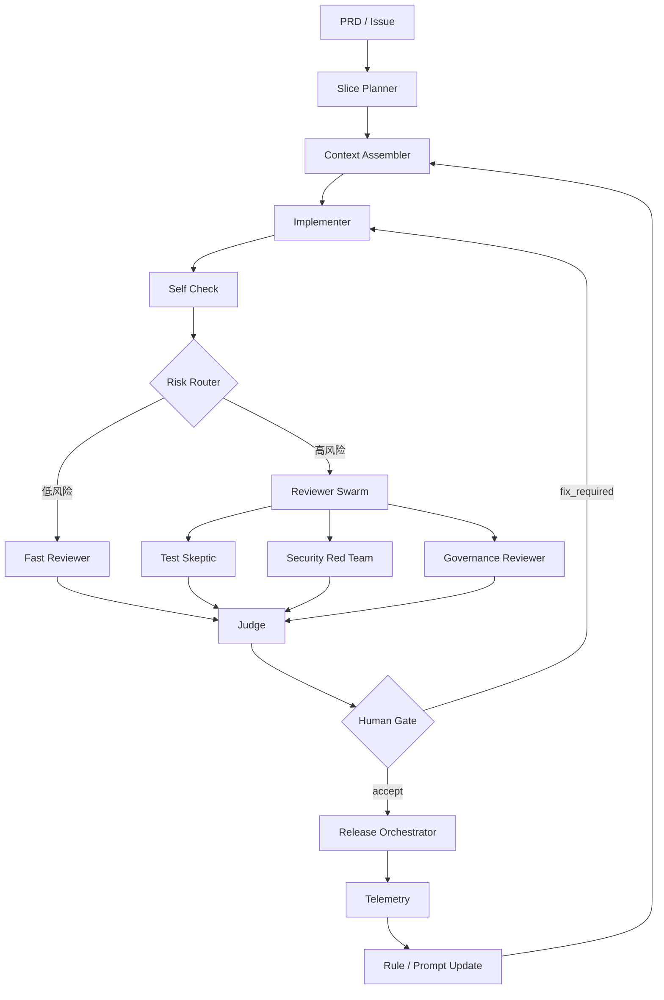

# AI Coding Harness 蓝图

AI Coding Harness 是把 coding agent 接入真实工程系统的运行层。它不是单个 Prompt，也不是某个供应商 SDK，而是一组可组合的工程组件。

## 目标架构



## 组件职责

| 组件 | 必须做 | 不应该做 |
| --- | --- | --- |
| Slice Planner | 把需求拆成可验收垂直切片 | 过早指定所有实现细节 |
| Context Assembler | 选最小充分上下文 | 无脑塞整个仓库 |
| Implementer | 实现当前切片并自检 | 自己批准自己 |
| Risk Router | 判断是否需要深审 | 把所有变更都走重流程 |
| Reviewer Swarm | 多角色只读审查 | 直接改代码 |
| Judge | 去重、定级、聚合证据 | 发明新事实 |
| Human Gate | 裁决高风险和争议 | 人肉补第一层审查 |
| Release Orchestrator | 灰度、监控、回滚 | 测试通过就直接发布 |

## Tool Risk Model

OpenAI 的工具分级思路可以直接用于 AI Coding：

| 工具类型 | 风险 | 默认策略 |
| --- | --- | --- |
| 只读文件 / 搜索 | 低 | 自动允许 |
| 本地测试 / 构建 | 低到中 | 自动允许，记录输出 |
| 写工作区文件 | 中 | 允许，但必须 diff 可审 |
| 修改依赖 / package scripts | 高 | AI reviewer + human gate |
| 数据库写入 / migration | 高 | release reviewer + human gate |
| 生产 API / secrets / deploy | 极高 | 明确人工批准，强审计 |
| 删除 / 批量移动 | 高 | 默认暂停，除非任务明确要求 |

## 状态与证据

长任务不能依赖一条长聊天历史。Harness 应保存：

- `task-slice.md`：当前切片目标、非目标、验收标准。
- `context-pack.md`：规则、相关代码、验证命令、风险面。
- `self-check.md`：Implementer 自检结果。
- `review/*.json`：各 reviewer 结构化输出。
- `evidence/`：测试结果、trace、截图、日志、构建输出。
- `judge-report.json`：最终风险摘要。
- `human-decision.md`：接受、拒绝、豁免、回滚要求。

## 最小落地方式

不用一开始做平台。可以先在仓库里放：

```text
.ai-coding/
├── prompts/
│   ├── implementer.md
│   ├── review-spec.md
│   ├── review-tests.md
│   ├── review-security.md
│   ├── review-governance.md
│   └── judge.md
├── schemas/
│   ├── reviewer-output.schema.json
│   └── acceptance-report.schema.json
└── runbooks/
    ├── ai-review-changed.md
    └── human-gate.md
```

然后逐步接入：

1. 本地命令：`make ai-review-changed`。
2. PR 评论：自动发布 Judge 摘要。
3. CI artifact：保存 reviewer JSON 和证据包。
4. GitHub Action：低风险自动跑，风险高时等待人工 gate。
5. Dashboard：展示趋势、噪音、逃逸缺陷和 reviewer 命中率。
