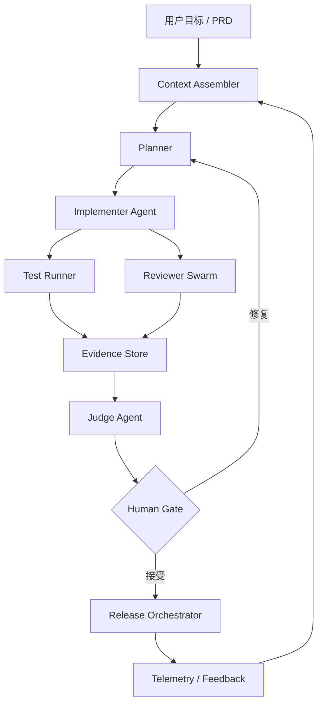

# Harness Engine

AI Coding 的重心正在从 **Weights** 和 **Context** 继续外移到 **Harness Engine**。模型能力和上下文工程仍然重要，但真正决定团队能否稳定交付的是：工具、协议、安全、工作流图、多 Agent 编排、技能、审计、回滚和人工裁决点。


## 为什么 Harness Engine 变成核心

| 阶段 | 主要关注 | 局限 |
| --- | --- | --- |
| Weights | 预训练、微调、RLHF、Scaling Law | 团队很难直接改变基础模型能力 |
| Context | RAG、Memory、Prompt、长上下文、Context Engineering | 能提高单次任务质量，但不能保证工程交付闭环 |
| Harness | MCP、工具生态、协议、安全、编排、多 Agent、Workflow Graphs | 把模型能力封装成可控、可审计、可回滚的软件系统 |

Harness Engine 的本质是：**把 LLM 从“会回答/会写代码”变成“在约束内执行工程流程的运行系统”**。

## AI Coding 中的 Harness 分层



| Harness 组件 | 作用 |
| --- | --- |
| Context Assembler | 选择最小充分上下文，避免把整个仓库塞给模型 |
| Planner | 把 PRD 拆成可验收的垂直切片 |
| Tool Runtime | 执行读写文件、测试、浏览器、MCP、CI 等工具 |
| Workflow Graph | 把实现、审查、修复、验收、发布变成有状态流程 |
| Reviewer Swarm | 多角色 AI 先审，降低人工第一审成本 |
| Evidence Store | 保存测试、trace、日志、截图、finding、风险豁免 |
| Policy / Security | 控制权限、危险操作、secrets、生产 API、prompt injection |
| Human Gate | 只在 blocker、high、争议、产品判断时让人裁决 |
| Release Orchestrator | 灰度、监控、回滚和反馈学习 |

## 和验收模块的关系

刚刚讨论的 AI-native 验收不是独立 checklist，而是 Harness Engine 的一个子图：

```text
Implementer -> Self Check -> Reviewer Swarm -> Judge -> Human Gate -> Fix / Release
```

所以站点后续的重点应该是：

- 不只写“如何 Prompt AI 写代码”。
- 更要写“如何设计 Harness，让 AI 编码、审查、测试、发布在系统里闭环”。
- 人类从一线 reviewer 变成 Harness 规则设计者、风险 owner 和最终裁决者。

## 最小 Harness Engine

一个团队不需要一开始做完整平台。最小可用 Harness 可以是：

```text
AGENTS.md / 仓库规则
+ Context Pack 模板
+ Implementer Prompt
+ Reviewer Swarm Prompt
+ Test Skeptic Prompt
+ Security Red Team Prompt
+ Judge JSON 契约
+ CI 验证命令
+ Evidence Report
+ Human Gate 规则
```

当这些稳定后，再逐步产品化为命令、GitHub Action、MCP server、Dashboard 或内部平台。


## 相关阅读

- [业界 Harness 模式整理](/harness/industry-patterns)
- [AI Coding Harness 蓝图](/harness/ai-coding-harness)
- [附录：Claude Code Best Practices 阅读笔记](/appendix/claude-code-best-practices)
