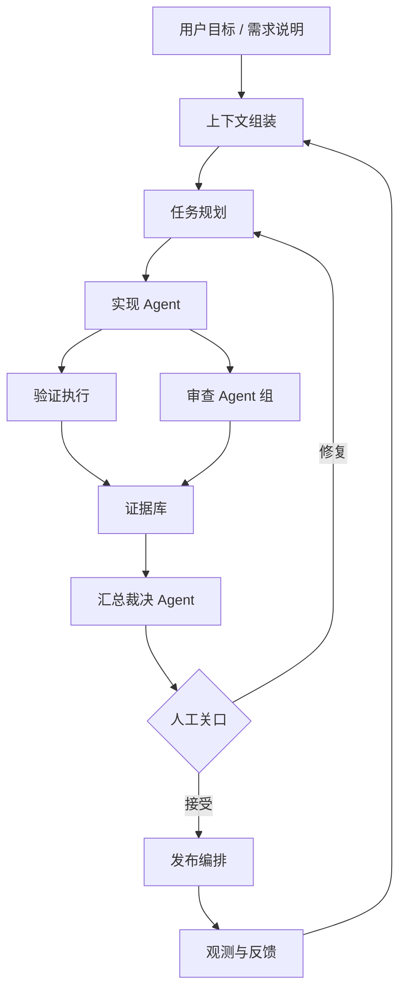

# Harness 引擎

AI Coding 的重点正在从“模型有多强”“上下文给多少”，转向“有没有一套可靠的 Harness”。这里的 Harness 指的是：把模型、上下文、工具、权限、状态、审查、证据、发布和人工介入串起来的工程运行框架。

模型能力和上下文工程仍然重要，但真正决定团队能否稳定交付的是：Agent 能不能在约束内工作，出错后能不能恢复，风险能不能被看见，最终责任能不能落到人。


## 为什么 Harness 变成核心

| 阶段 | 主要关注 | 局限 |
| --- | --- | --- |
| 模型能力 | 预训练、微调、推理能力、代码能力 | 团队很难直接改变基础模型能力 |
| 上下文工程 | 仓库规则、相关文件、文档、长上下文、记忆 | 能提高单次任务质量，但不能保证交付闭环 |
| Harness 引擎 | 工具、权限、工作流图、审查、证据、人工关口 | 把模型能力封装成可控、可审计、可回滚的软件系统 |

一句话：**模型负责“能不能做”，Harness 负责“能不能可靠地做完，并让团队敢于接受结果”。**

## AI Coding 中的 Harness 分层



| 组件 | 作用 |
| --- | --- |
| 上下文组装 | 选择最小充分上下文，避免把整个仓库塞给模型 |
| 任务规划 | 把需求拆成可验收的垂直切片 |
| 工具运行层 | 执行文件读写、测试、浏览器、MCP、CI 等工具 |
| 工作流图 | 把实现、审查、修复、验收、发布变成可恢复流程 |
| 审查 Agent 组 | 多角色 AI 先审，降低人工第一审成本 |
| 证据库 | 保存测试、链路记录、日志、截图、问题项、风险豁免 |
| 权限与安全 | 控制危险操作、密钥、生产 API、提示词注入和工具边界 |
| 人工关口 | 只在阻断级、高风险、争议和产品判断时让人裁决 |
| 发布编排 | 串联灰度、监控、回滚和反馈学习 |

## 和验收模块的关系

AI 原生验收不是独立清单，而是 Harness 引擎里的一个子流程：

```text
实现 Agent -> 自检 -> 审查 Agent 组 -> 汇总裁决 Agent -> 人工关口 -> 修复 / 发布
```

所以本站不只讨论“怎样提示 AI 写代码”，更关注“怎样设计一套系统，让 AI 的实现、审查、测试、发布都能闭环”。人类的角色也会从第一层审查人，转为规则设计者、风险负责人和最终裁决者。

## 最小可用 Harness

团队不需要一开始就做平台。最小可用 Harness 可以只是仓库里的几份文件和几个命令：

```text
AGENTS.md / 仓库规则
+ 上下文包模板
+ 实现 Agent提示词
+ 审查 Agent 组提示词
+ 测试质疑 Agent 提示词
+ 安全红队 Agent 提示词
+ 汇总裁决 Agent JSON 契约
+ CI 验证命令
+ 验收证据报告
+ 人工关口规则
```

等这些流程稳定后，再逐步产品化为命令、GitHub Action、MCP server、看板 或内部平台。

## 相关阅读

- [业界 Harness 模式整理](/harness/industry-patterns)
- [AI Coding 的 Harness 蓝图](/harness/ai-coding-harness)
- [附录：Claude Code Best Practices 阅读笔记](/appendix/claude-code-best-practices)
