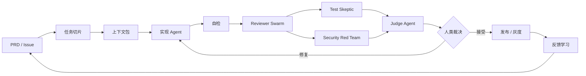

# AI Coding 全流程地图

AI Coding 的关键不是“让 AI 多写”，而是让每个阶段都有明确输入、输出和下一阶段消费方式。理想流程是可循环、可审计、可自动化的。

## 阶段定义

| 阶段 | 输入 | 输出 | 失败信号 |
| --- | --- | --- | --- |
| 任务切片 | PRD、issue、业务目标 | 小切片计划、非目标 | 一次改动包含多个不相关目标 |
| 上下文包 | 规则、代码、契约、历史决策 | 最小充分上下文 | AI 需要猜架构或运行命令 |
| 实现 | 上下文包、切片计划 | 代码、测试、文档 | 夹带重构、生成并行实现 |
| 自检 | diff、本地命令 | 初始修复、测试结果 | 没跑验证或弱化测试 |
| AI 审查 | diff、规则、测试结果 | findings、missing evidence | 泛泛而谈、无文件行号 |
| Judge | 多份 reviewer 报告 | 去重后的风险摘要 | 没有 severity 或 owner |
| 人类裁决 | 高风险摘要、证据 | 接受、拒绝、豁免、修复指令 | 人被迫从零看全部 diff |

## 关键约束

- AI reviewer 默认只读，不直接修改代码。
- Implementer 不给 reviewer 解释“为什么这样写”，避免 reviewer 被带偏。
- Judge Agent 不新增事实，只聚合、去重、定级和标出争议。
- 人类只处理 blocker、high、needs-human 和产品判断。
